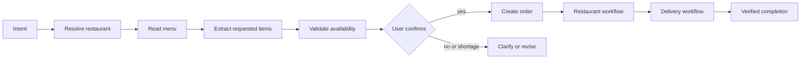

# AI ordering workflow

## Trust boundary

The model is used only for intent recognition, entity/quantity extraction, and conversational wording. It never receives tools that can mutate MongoDB or change order status. Every extracted object must be schema validated before a deterministic service acts on it.

## Planned graph

Business nodes read and write through domain services. The model cannot declare a session complete. Session state and graph checkpoints are intended for Redis; durable orders and terminal failure records belong in MongoDB.

## Streaming

The planned AI endpoint uses SSE. Text may stream to the browser, but partial output has no authority to create an order. The backend validates structured extraction and availability before any state mutation.

## Current status

The typed state and infrastructure boundary are scaffolded. Prompt modules, validated extraction, graph nodes, and SSE are subsequent milestones and are not yet wired.
