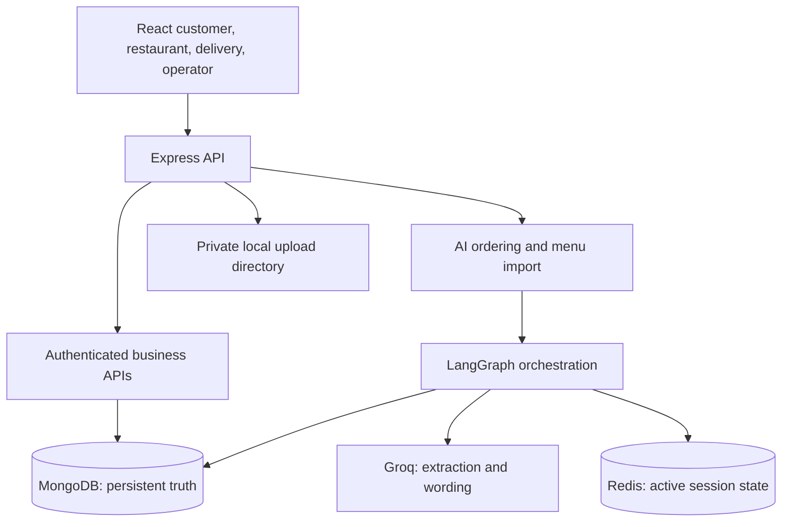

# Architecture

Normal routes validate and authorize requests, then call deterministic services. MongoDB stores accounts, menu drafts, document metadata, orders, attempts, and failed sessions. Redis stores expiring AI ordering sessions. Local private files store submitted account documents and source menu files. Production deployments need a durable private object store shared by backend instances.

The LLM can extract intent and menu entries or phrase a verified response. It cannot update orders, inventory, availability, account status, or delivery assignment. Inventory reservations and order status changes are backend-controlled. Menu extraction produces a reviewable draft; it never publishes parsed items without an explicit restaurant action.
