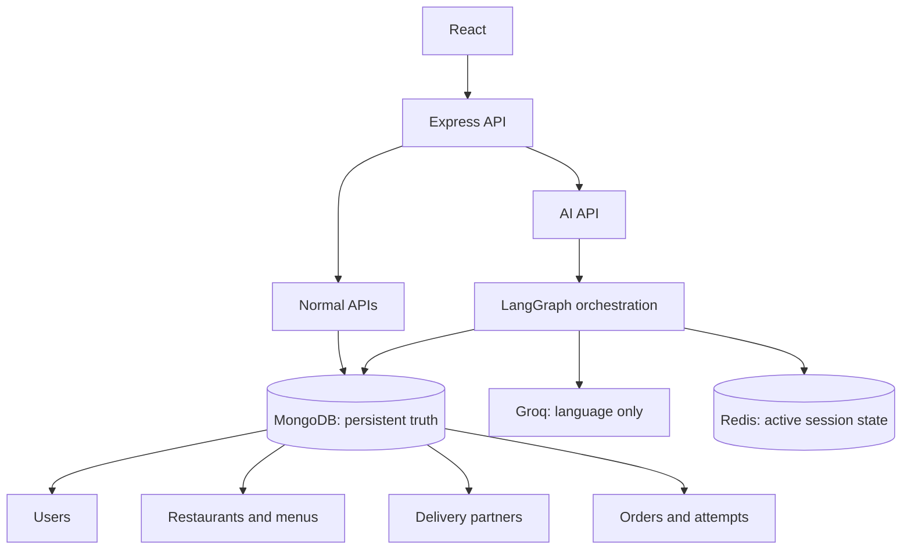

# Architecture

React communicates through Express. Normal APIs and AI workflow nodes use domain services and repositories; route handlers do not own business rules. MongoDB is the permanent source of truth. Redis contains expiring conversation and graph state. The model can interpret and phrase requests but cannot write data or decide availability, price, assignment, or lifecycle status.

The first implementation milestone establishes this boundary and typed session contract. Domain models, authentication, ordering, restaurant operations, delivery, and AI graph nodes are added as subsequent milestones. See [api.md](api.md), [database.md](database.md), [ai-agent.md](ai-agent.md), and [deployment.md](deployment.md) for the planned contracts and current gaps.
